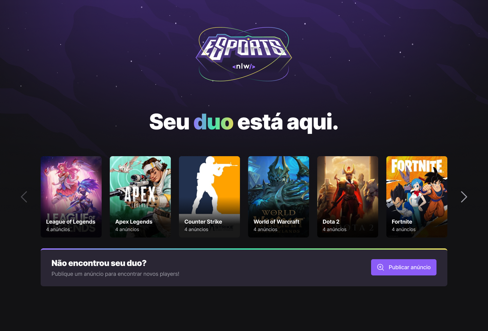

<div align="center" >
  
</div>
<br>


<div align="center">
  
  

</div>


# NLW eSports
Projeto desenvolvido durante a semana NLW da Rocketseat. O projeto será desenvolvido em três frente: `Back-end`, `Front-end` e `Mobile` <br>
O `Back-end` será desenvolvido utilizando o nodejs, typescript e express. <br>
O `Front-end` será desenvolvido utilizando reactJS, typescript e tailwindcss. <br>
O `Mobile` será desenvolvido utilizando reactNative e Expo. <br>

O projeto tem como propósito criar uma aplicação web onde será possível visualizar e criar anúncios para poder encontrar um parceiro para uma jogatina! <br>
Já a versão mobile, tem também uma funcionalidade para facilitar a conexão entre estas duas pessoas. <br>
O back-end feito em node, cria uma API própria que será consumida pela web e mobile.


<br>
<h3 align="center">Desenvolvido com: </h3>
<br>
<div align="center">
    
    
    
    
    
    
    
</div>
<br>

### 📘 Ferramentas/Bibliotecas utilizadas
- Design:
  - `Figma`
- Versionamento de código:
  - `Git`
  - `Github`
- Back-end
  - `NodeJS`
  - `Express`
  - `Sqlite`
  - `Typescript`]
  - `Prisma`
- Front-end
  - `ReactJS`
  - `Typescript`
  - `Axios`
  - `Phospor-react`
  - `tailwindcss`
- Mobile
  - `ReactNative`
  - `Typescript`
  - `phosphor-react-native`
  - `react-native-safe-area-context`
  - `react-native-screens`
  - `Expo`
    - `clipboard`
    - `notifications`
    - `linear-gradient`
    - `status-bar`

## Instalação
```bash
# Faça o clone do repositório
```

### Back-End
```bash
# Acesse a pasta do projeto pelo terminal (server)


# Faça a instalação das depêndencias
  npm i

# Executando o projeto no ambiente de desenvolvimento
  npm run dev
```

### Front-End
```bash
# Acesse a pasta do projeto pelo terminal (web)


# Faça a instalação das depêndencias
  npm i

# Executando o projeto no ambiente de desenvolvimento
  npm run dev
```

### Mobile
```bash
# Acesse a pasta do projeto pelo terminal (web)


# Faça a instalação das depêndencias
  npm i

# Executando o projeto no ambiente de desenvolvimento
  expo start
```

## ✔️ Autores

- [Renan Fachin](https://github.com/RenanFachin/)

## 📄 Professores

- [Rodrigo Gonçalves](https://github.com/rodrigorgtic)
- [Diego Fernandes](https://github.com/diego3g)

## 📄 Referência

- [Rockeseat](https://www.rocketseat.com.br/)
